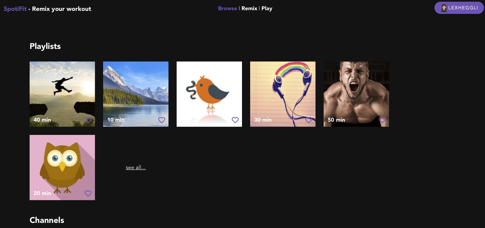
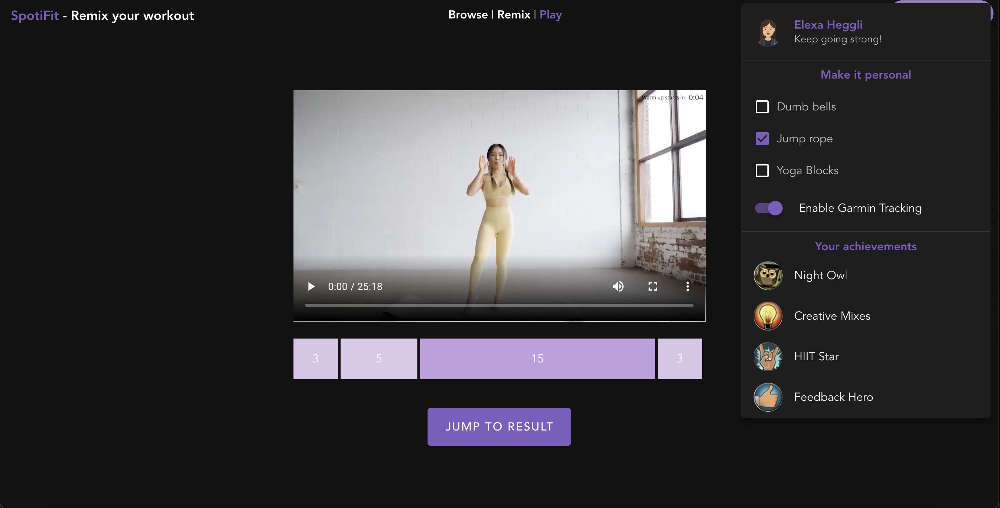
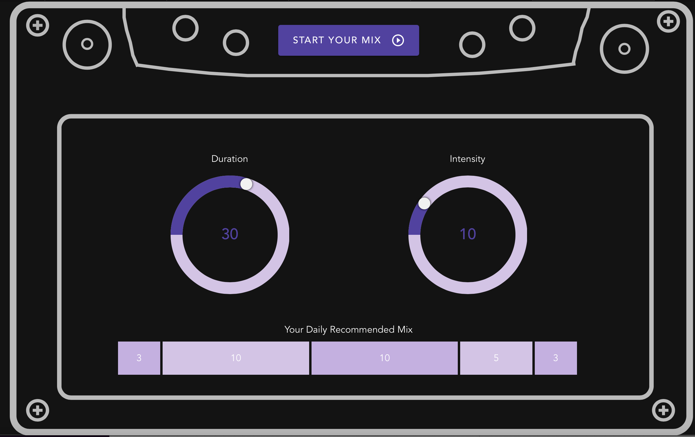
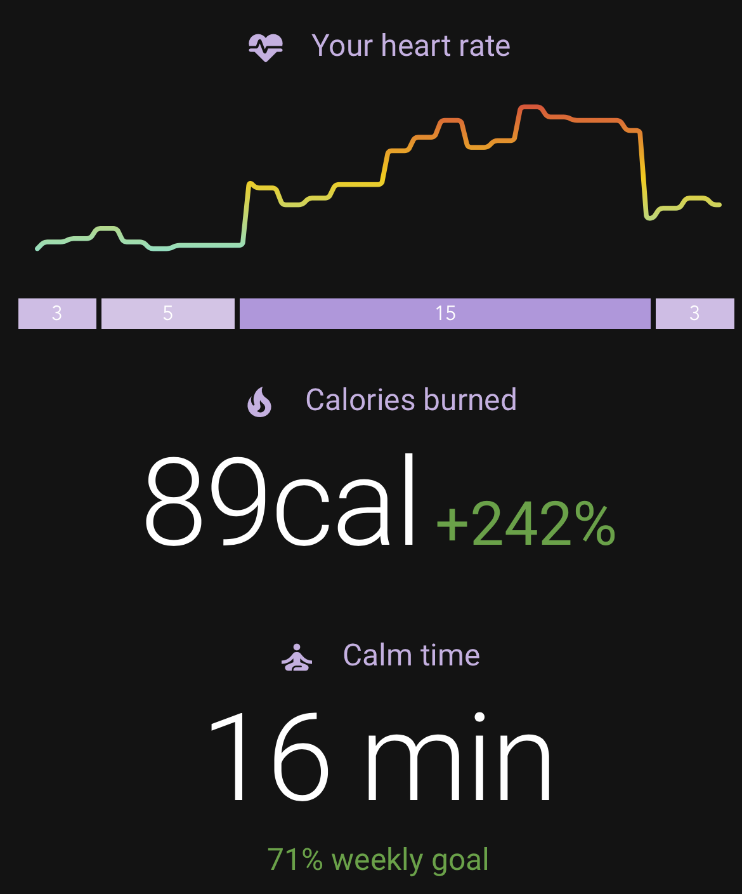

# SpotiFit
This repository includes the project of the [HackZurich 2021](https://devpost.com/software/remix-essentially-spotify-for-workouts-excersises) ([source repository](https://github.com/JollyBrackets/remix)). The code is written in `Vue` with `JavaScript`.

## Screenshots





## Inspiration
Spotify has perfected its playlists: users can listen to mixes of a specific genre, playlists tailored specifically to their own taste, and listeners can even create their own mixes from scratch. All of these creations can be rated, saved, personalized, and shared! Why hasn’t the huge workout community jumped on this train? So many people find themselves overwhelmed by the huge offer of random workout and mindfulness videos online. The comfort of getting an exercise remix tailored specifically to your needs (with your Garmin Watch data and previous workout history) lowers the barrier to start and keep exercising immensely, essentially Spotify for workouts/exercises.

## What It Does
SpotiFit creates workout and mindfulness playlists tailored specifically to your daily needs in the comfort of your own home. Your Garmin-Watch data evaluates whether you’re in need of some relaxation after a stressful day or rather a high-intensity workout focusing on particular muscle groups. If necessary the remixes can be adjusted by their length and intensity with a fun mixtape interface. The aim is to get you exercising and not organizing! SpotiFit grows with you, the more remixes you complete, the better they will get! After every playlist, you get an overview of your Garmin health data, a chance to compare with others, and the ability to give ratings. To ensure a smooth beginning SpotiFit will either analyze previous Gamin data or give new users a quick questionnaire. For long-term customer retention, there is a motivating badge collection system, a browsing page to mark your favorite trainers and genres to personalize the remixes even more. Adding to that, SpotiFit will ever so often add totally new exercise types to spice up your daily remixes.

## How We Built It
Using our Vuetify knowledge we created a front-end web app to showcase the best parts of our idea. To customize the biometric data collected with the Garmin wearable device, we used Jupyter Notebooks and Firebase for data storage and serving.

## Challenges We Ran Into
Our main challenge was to focus our various ideas on a concrete and simple project. To create a usable and complex system that has a simple and motivating interface for users of all levels. Adding to that, fetching and providing useful Garmin data also proved to be more difficult than expected.

## Accomplishments That We’re Proud Of
Our Pride and Joy is definitely the idea behind it all. We also had a lot of fun coming up with a unique user interface.

## What We Learned
From CSS syntax to Firebase Storage to patience with slow Wifi, Xcode update and various certificate failures, to pushing our energy limits to the extreme, we definitely got many new experiences!

## Project setup
```
npm install
```

### Compiles and hot-reloads for development
```
npm run serve
```

### Compiles and minifies for production
```
npm run build
```
